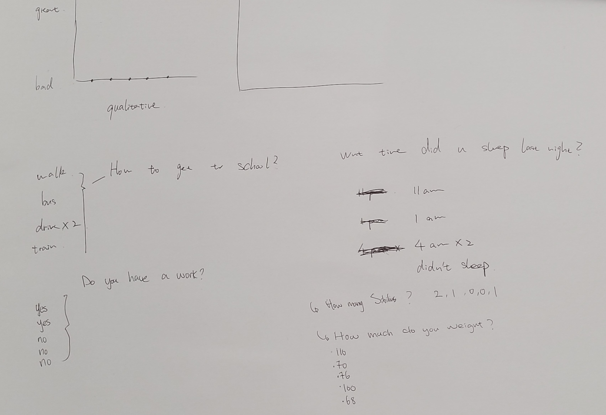

# Week 01

[← Back to Home](../index.md)

## Documentation 

### Friday 6th March
We had our introductary class to which we were taught the basis of what the course will teach us. Towards the last section of the class we were tasked with our first assignment getting into groups and coming up with questions to ask each other. For our questions our group chose we decided on these five. How do you get to school?; Do you work?; What time did you sleep last night?; How much do you weigh?; How many siblings do you have?

For our first question we noted down that two of us drive to uni while the remaining three, trained then walked or took the bus. Moving onto our work question we discovered that two people had jobs while the rest of us did not. The next question was general one to which we all found our sleeping times were all over the place, one person sleeping at 11 pm, another sleeping at 1 am and two of us sleeping around 4 am and the last one not sleeping at all which is pretty surprising as they didn't even look tired at all.

We just decided to note down a random question, that being how much do you weigh. We noticed that were two groups, the first group of three ranging from the 60s to high 70s in kilograms then myself and another being over 100 kilograms. For our final question we decided to go with was family related, a simple one; how many siblings do you have. Two were only childs while the rest of us had a sibling or two. Afterwards we drew up a visual representation of our questions.

For the individual section after, I decided to pick what I complain about on a daily basis. I began noting this down on Saturday stretching out to Tuesday. I don't really have a good reason as to why I picked this to track in particular, I saw the examplar questions and decided to use the first one to see how much I really complain about stuff on a daily basis. 

To be completely honest when I was collecting data on what I complain about, it felt as though I was limiting how much I complained since I was recording it down on paper. During my collection process I found myself often trying to get a rough estimate of how many times I complain since, for exmaple during gaming sessions so many emotions can occur. Which may lead to me laughing, controlled raging, etc. 

So I may forget to note it down. Visualising my data I just did the similar thing to our in class activity with our groups, drawing pictures to represent each question or rather answer to them. When I was drawing each response I found myself struggling to decide what make symbol for chores be, in the end I chose a rubbish bag since it was simple to draw other than other things such as plates, cleaning, mowing grass, etc. I noticed myself being more hesistant on how often I complained, it seemed like I held myself more accountable since I was now noting down how often I complained about certain things.

For the choices I decided to make for my data collection I feel as though I picked the easy route as this is something I'm comfortable with noting down and showing. Although I feel as though that I could've done a better job at doing the data visualisation part due to some drawings having the possibilty of being misunderstood as something else without the questions I used to represent them available. As for what is left out I suppose a better visualisation could've been done or rather if I had picked better question to ask myself perhaps the results would have been better.

How does this exercise relate to data humanism and the *Dear Data* project?

Any other reflections?

## Images & Media

## AI Usage Statement

I did not use AI for this documentation.