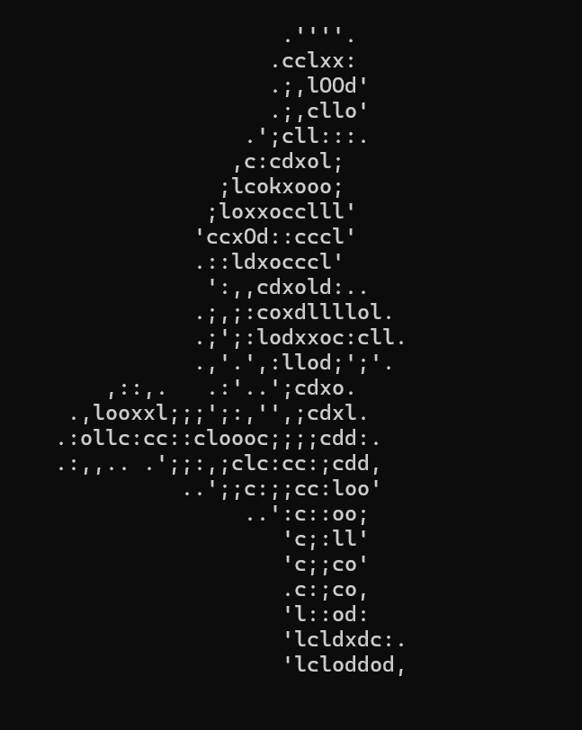
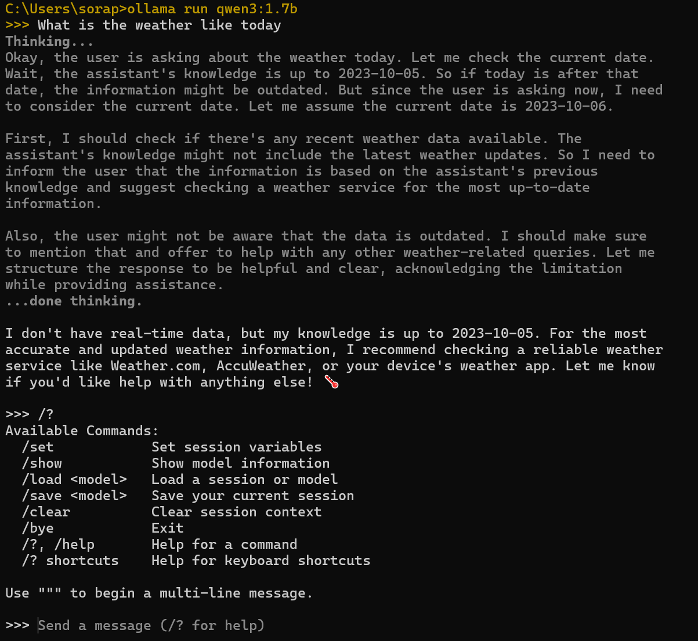

# Week 03

[← Back to Home](../index.md)

## Documentation 

### Friday 20th March
In this class we learned about Live Data, first going over a brief history on the early versions of live data. 

This consisted of the Dangling String made by Natalie Jeremijenko in 1995. It was made from a plastic string, electric motor and an ethernet cable. Which allowed it to represent many things such as Internet being made visible, the more movement it made this indicated heavier network traffic and many things. This string was an early prototype for designing calm technology.

A more recent example made by Mark Hansen & Ben Rubin, the Listening Post was created as a collaboration between theese two Rubin being an artist and Hansen, a statstician. It was up bettwen 2002-2005, essentially it was a live visualisation of over thousands of online conversations, shown by 231 electronic displays. The screens displayed random words from the conversations online, they were also spoken via a text to speech program.

Afterwards we discussed a bit about browsers and how they display data for us to read, such as information about the weather, definition of a word, bus & train times, etc. Moving onto a question of what if we want to use the data itself rather than just reading it, thus leading into the introduction the command line or terminal. The terminal is a text based interface that is used for communicating directly with our computer/laptop.

Some of the things that we can do in the terminal are; Navigating files and folders, creating and editing plain text files, sending emails, running programs and asking the internet for data. In order to retrieve data we can use in the terminal we get raw data from curl, which is a free and open source command line tool for transferring data over the Internet. It does this by sending a request to a web address and shows us what come back.

The different commands we tried out, showed things such as animations of a person running, parrot dancing, earth spinning. Along with data displaying the weather for the next three days, starting from morning, noon, evening then night.

As we played around and experiment with curl we eventually moved on and discussed what a API is. The API is a structed way for programs to both communicate and exchange data. Instead of us reading the response in a terminal our code can read and do something with it.

## Independent Study
I decided to go with the digital approach as I felt as though it would be quite tedious to approach this task with the analogue/physical approach.

The API I chose to work with LaunchBox Games Database, in order to access this I had to do some research through Reddit and eventually I came across this site. 

The decision to map with data as I am not confident with making something in material form. I also wanted to challenge and learn something by doing it in data form.

I used GeminiAI to help me with the p5.js sketch however, I encountered many problems as I ran into API key errors, the CORS issue. In some cases problems that I couldn't solve on my own so I put it back through GeminiAI to solve it for me. Unfortunately leading to yet another problem.

Most definitely find out how to do process properly as I left it till the last minute to complete, which resulted in major troubles as I couldn't figure out how to solve the issue involved with the p5.js web editor. as I mentioned earlier API key problems. In reality I really should've look at more websites that focus on games rather than just look at like 5-6 and deciding it'll do.

## Images & Media

*p5.js sketch failure*

## AI Usage Statement

I used GeminiAI to help me create and learn from the p5.js sketch. By reading through the code and figuring out the problems.

Google. (2026). Gemini (March 5 version) [Large language model]. https://gemini.google.com/
