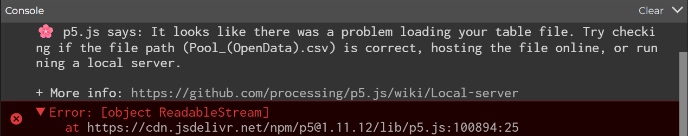

# Week 04

[← Back to Home](../index.md)

## Documentation 

### Friday 27th March
For our lecture today we went over Artificial Intelligence and briefly reviewed Vibe Coding as it's related to LLM's which are in itself AI. We learned about Agentive AI which are categorised into three different uses. The first one being Code Automation this includes AI such as Claude Code and Google Gemini. The seoond one is Personal Computing, consisting of OpenClaw and Claude Cowork. And lastly for Visual Communication, Google Stich and Embedded tools in Adobe, Figma, etc. So essentially Agentive AI uses tools, can navigate interfaces and perform tasks towards goal-oriented actions. 

Afterwards we learned about local ai called Ollama which is an open source tool that allows us to run AI models on own laptops. Any and all data such as prompts and outputs remains on our device however, the downside of Ollama is that it is less capable than other ai such as ChatGPT. We then explored what Ollama could do I asked it for ideas on how to visualise the data I collected in my 1st experiment. It came up with 5 ideas. 

### Idea 1: List with symbols, a box or circle labeled "What I Complain About". Use stars or dots to represent the complaints and draw a person icon at the top to show th perspective.

### Idea 2: Tree Structure, you draw a tree with the roots as "What I Complain About". Different Branches would represent the main things I stressed with and beneath them would be the sub branches that represent the specific of the complaint.

### Idea 3: Mind Map, that is centered around the question this is similar to the Tree Structure as it does follows the same strucutre.

### Idea 4: Flowchart, this will have different stages first starting off with the question "What I Complain About" then followed by the complaints with an ending, for example "I need to be more positive" such and such.

### Idea 5: Icon Based Visualisation, similar to the first idea however, it focuses more on uses icons rather than using shapes.

Moving on from the activity, we had a rundown of Local Vs Cloud AI. When using tools such as ChatGPT, CoPilot or Gemini, the prompts you use are sent to remote servers where large models then process them and return a response back. However, it was the opposite of what we had done with Ollama, these are the 4 things; We need internet connection, the data leaves our laptop, we rely on external infrastructure and the models are larger and more capable. Briefly we touched upon three a diagram of showing the comparison between University GenAI tools. Copilot, Gemini and NotebookLM. It showed the cost, their model, functionalities, what it's best used for and if it can generate images or not;

NotebookLM is a research tool that was made by Google, it allows you to upload sources for analysis, discussion and can produce artefacts as well. It can draw on sources we provide, able to syynthesise across various documents, websites and media. Can produce different outputs e.g. text, tables, mind maps, slide decks, etc. There is also an audio overview feature that generates a podcast like conversation about the sources you've provided. 

## Independent Study
The dataset I decided to go with was the Pool(OpenData) by Christchurch City Council. As I used to swim when I was younger so I wanted to see what was within this particular dataset. 

The AI tool NotebookLM helped me to understand what is in the pool(OpenData) dataset by explaining that it is structured into various key columns that provide technical, status-based and geographic information. 

Categorised into four parts: 

### Core Identification and Type. This listed the following; PoolID which is a unique numerical identifier for each entry, Type categorises the feature as a Swimming Pool, Spa Pool or Protable Above Ground.  Style describes the construction of the pool itself, whether its an In Ground, Above Ground or Portable Above Ground. And the Name which identifies specific public or commerical facilities e.g. Sockburn Splash, Halswell, Pioneer 25m Pool, etc. 

### Status and Lifecycle; The Status recorded the current state of a pool, these ranged from operational, removed, backfilled, empty, proposed or Damaged non operational. The file tracked the dates for each record, from the date it was created to the last edit date it basically shows a timeline of data updates ranging from 2021 to 2026.

### Regulatory and Management Data; A true or false section in the data indicated whether or not the feature was being managed by the local council, for short CCCManaged. The ExemptedType and ReasonExempt were columns that provided legal or techniqual like "5.a", "5.e" and the reasoning for expemptions could include "having 1.2m high sides, being Enclosed Within a Building or having Supervisors employed"

### Lastly the Geographic and Physical Measurements; The LocationCertainty indicated the overall reliability of the spatial data, providing it with labels like Accurate, Indicative Only, Unknown or Not Verified. StreetAddressID is a numerical ID linking the feature to a specific location. The SHAPE_Length and SHAPE_Area provided precise geometric data for the perimeter and surface area of each pool. For example Pool A has length of 62.7 units and an area of 200.5 units.

There were many other questions that NotebookLM answered although I'll show them with screenshots so as to now overcrowd this week's experiment with endless paragraphs.

When I asked NotebookLM to generate me a code for p5.js to represent the data, there was an error that occurred with one of the readable streams at one of the links. When I went to check the problem at the site it came up with Forbidden. I tried to do any version of the p5.js code however, it came up with yet another error. So instead I asked the AI to use a different medium pivoting towards infographics or rather poster fomat to represent the dataset in a simplified way. As for the posters themselves I found them to be pretty generic as I only gave direction for NotebookLM to make the poster appeal to the audience and to focus on the most important details in the dataset. 

Moving onto ideas of a physical model NotebookLM showed me two ideas that seem like a good starting point for these models, The "Community Asset" Plinth and The "Ghost Pool" Excavation. For the Community Asset Plinth I would be creating a spatial map that uses two distinct materials to represent CCCManaged status of the pools. To represent the public facilities I could use wooden blocks with the height and diameter scaling to their area, then using small trasnlucent glass or plastic beads to represent the thousands of private residential pools. According to the impact of this model, it will create a powerful visual and tactile weight difference, allowing the audience to feel the significance of one public facility in comparison to the many private residential pools.

As for the "Ghost Pool" model this concept would be a large tray of earth or dark clay that represents the city landscape. Using clay and geometric stamps to create voids which are the empty spaces. These would be the operational pools but when filled with a contrasting material such as bright resin or wax, these represent the "ghosts" of the pools that no longer hold water. They are either backfilled or removed pools. Once completed this would show that the backfilled status which appears quite a lot in the dataset, as a visible mark on the model solidifying it as the loss of infrastructure.

What I learned from experimenting with NotebookLM is that it struggles with digital models of ways to show the dataset. Although this may be due to my small amount of experience in using p5.js web editor. 

With the different representation of the same data, I feel as though the viewer will be able to gain a general understanding of the data shown in these different representations. Although should the viewer try and approach these representations looking for the problem to solve it would leave them stumped, as it shows no solutions.

As I found the book to be quite lengthy I used GeminiAI to help me summarise the key ideas from the book itself. The core questiosn it identified were Data Science by Whom (Who are the scientists/analysts), Data Science for Whom (Who benefits from the results) and Data Science with Whose Interests in Mind (Whose values are being prioritized). So when I think about these questions that stem from the ideas in the Data Feminism book, I now look back at my dataset and find some struggle in answering it properly. Particularly who benefits from the results and whose values are being prioritizied, as I hadn't really thought about who would benefit from the data representations I created using NotebookLM as well as the values.  

Mikaere's framing of data as a strategic asset for Maori development informs me that should I apply a Maori lens to the data analysis in my dataset. This would help me to gain another perspective and they understand their own context the best and can help come up with solutions if needed, to either promote better usage of pools rather than letting them be backfilled or removed. In other cases find a way to reduce the amount of resources being used for private residential pools. 

My experience of working with AI as a design tool was somewhat troubling although I did find it helpful when it summarised a lot of text into key information. The part I found troubling was that I had to imagine what the code and some ideas for visualisation would look like as the AI wouldn't show it properly or there were errors somewhere that I didn't understand how to fix. 

## Images & Media

### Explanation of What is in the Dataset and Analysis of What is Missing from the Dataset

### p5.js Code

### Infographics for Pool Dataset

## AI Usage Statement

For this week's experiment I used the AI tool called NotebookLM. This included prompting the AI to create the p5.js code and Infographics. As well as telling me about the dataset and what was within it. 

I also used GeminiAI to help with the summarise this week's resources by copying the link to it and asking Gemini to summarise it directly from the source rather than other sites, now that I think about it I could've just used NotebookLM on its own instead of GeminiAI.

Google. (2026). NotebookLM (March 2026 version) [Large language model]. https://notebooklm.google.com/

Google. (2026). Gemini (March 5 version) [Large language model]. https://gemini.google.com/
